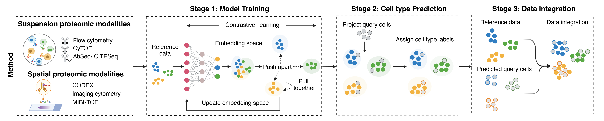

# CellFuse
We are thrilled to announce that **CellFuse** is now published in [*Cancer Research*](https://aacrjournals.org/cancerres/article/doi/10.1158/0008-5472.CAN-25-3699/785629/CellFuse-Enables-Multimodal-Integration-of-Single) 🎉


**CellFuse** is an R package for multimodal single-cell and spatial proteomics integration using supervised contrastive deep learning. Single-cell and spatial proteomic technologies capture complementary biological information; however, no single platform measures all modalities within the same cell. Most existing integration methods (e.g., Seurat, Harmony) are optimized for transcriptomic data and assume extensive shared feature overlap, an assumption that often fails for low-dimensional proteomic modalities.


### Workflow Overview
CellFuse operates in three sequential stages:

1. **Model Training** – Learn a shared embedding space using labeled reference data.
2. **Cell Type Prediction** – Project query cells into embedding space and assign labels via KNN.
3. **Data Integration** – Perform normalization to harmonize modalities.





This work has been led by [Abhishek Koladiya](https://github.com/AbhivKoladiya) from [Kara Davis Lab](https://kldavislab.org/) @Stanford


### Installation
CellFuse relies on Python for deep learning components via the reticulate interface.
Before using the package, please configure a Python environment with the required dependencies.

We recommend creating a dedicated conda environment:
```shell

# Create the environment
conda create -n myenv python=3.10 -y

# Activate the environment
conda activate myenv

# Install required Python packages
conda install pytorch pandas scikit-learn matplotlib seaborn
```

After creating the environment, configure it within R:
```

# Load and install R dependencies
required_packages <- c("reticulate", "remotes")

installed <- required_packages %in% rownames(installed.packages())
if (any(!installed)) {
  install.packages(required_packages[!installed])
}

# Use the conda environment from R
library(reticulate)

# Use the conda environment
use_condaenv("myenv", required = TRUE)

# Verify Python configuration
py_config()

# Install and load CellFuse:
devtools::install("karadavis-lab/CellFuse")

library(CellFuse)
```

## Getting Started
The best way to get started with CellFuse is to explore the package's vignettes and articles (available at https://karadavis-lab.github.io/CellFuse).

## Citation

```bibtex
@article{koladiya2026cellfuse,
  title={CellFuse Enables Multimodal Integration of Single-cell and Spatial Proteomics Data for Systems-level Analysis in Cancer},
  author={Koladiya, Abhishek and Good, Zinaida and Varra, Sricharan R and Domizi, Pablo and Bendall, Sean C and Davis, Kara L},
  journal={Cancer Research},
  year={2026},
  publisher={American Association for Cancer Research},
  doi={10.1158/0008-5472.CAN-25-3699},
  url={https://aacrjournals.org/cancerres/article/doi/10.1158/0008-5472.CAN-25-3699/785629/CellFuse-Enables-Multimodal-Integration-of-Single}
}
```
